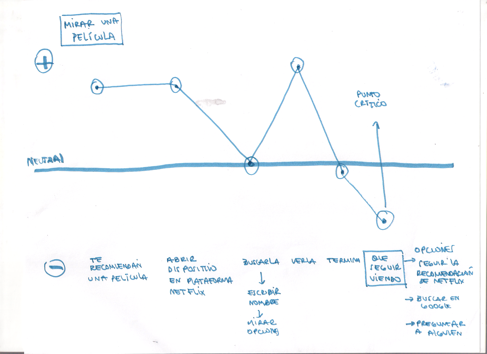
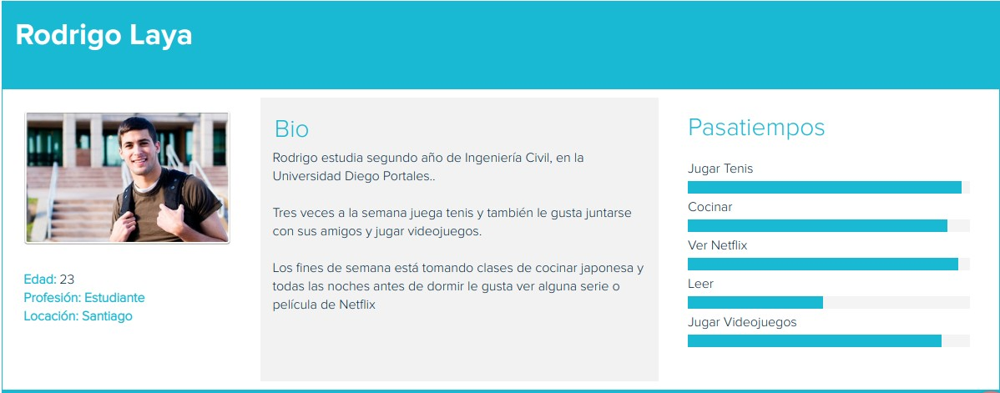
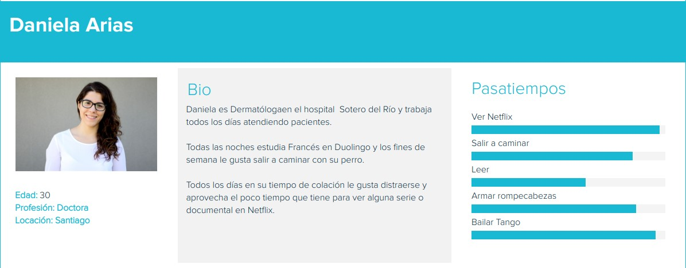
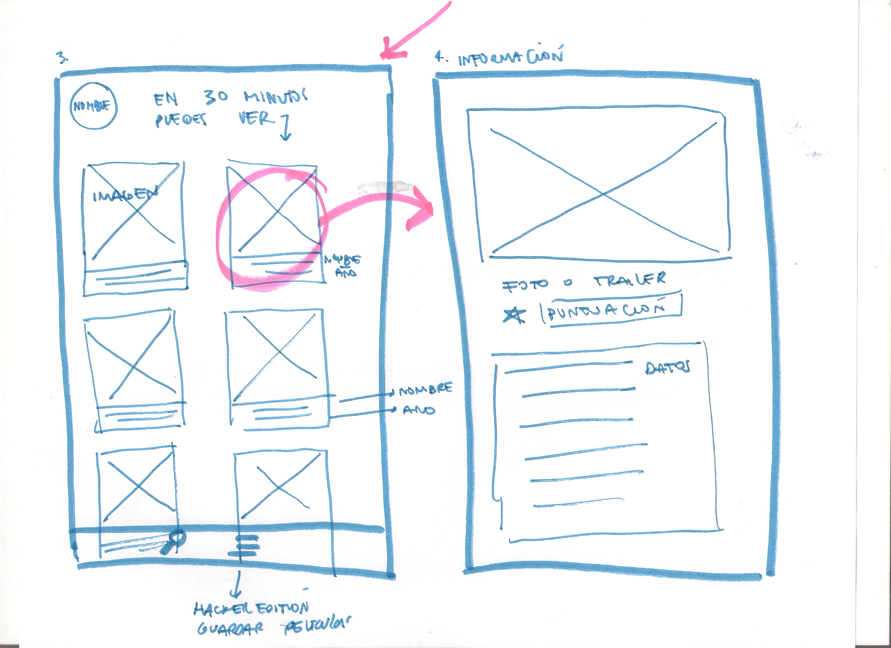
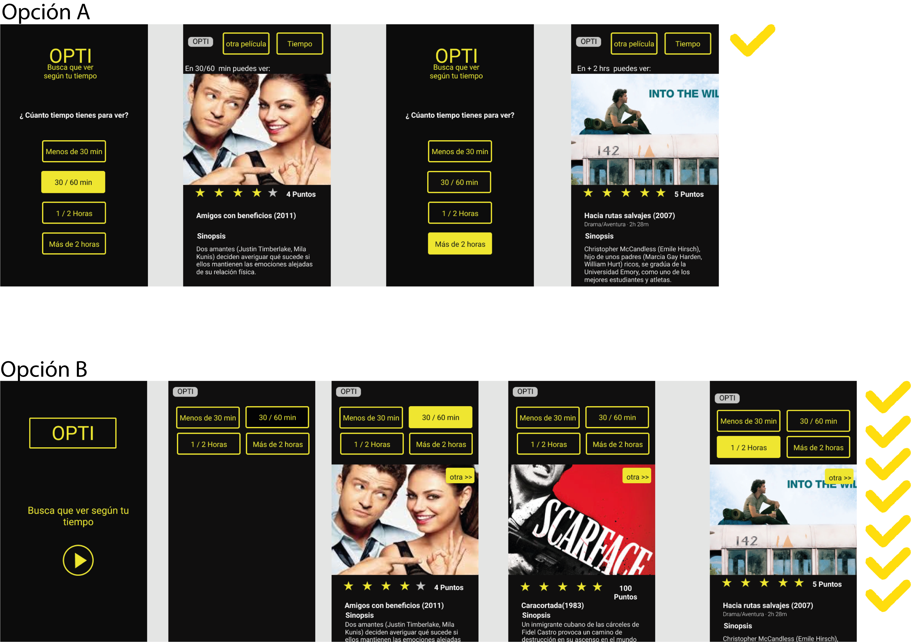
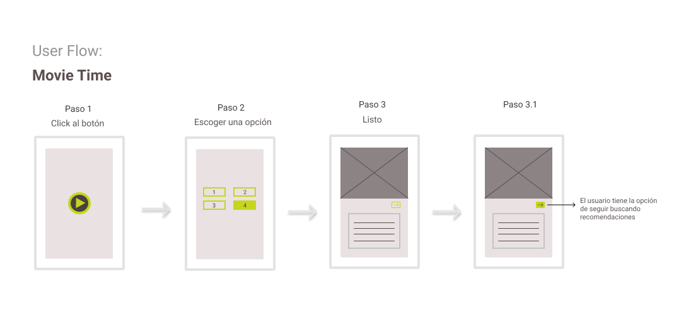

# Nombre que todavía no tiene

## **Descripción**
 es una aplicación...

## **Definición de usuario**
Se realizó una  [encuesta](https://docs.google.com/forms/d/1s_Q2comfimGzqFrxoVIecETbMywEb7x5iWU0fHTjIQw/edit#responses) para poder conocer más sobre las preferencias de los usuarios al momento de ver series y películas, mas del 70% ocupa netflix y ve entre 1 a 2 horas diarias,Chile ocupa el [quinto lugar](https://www.m360.cl/noticias/cultura-pop/actualidad/chile-es-el-quinto-pais-del-mundo-ve-mas-netflix/2017-12-11/153914.html) de personas que ven Netflix todos los días, la mayoría tiene entre 18 y 34 años,la mayoría trabaja y un 62% le gusta recibir recomendaciones de que ver.

En base a nuestra investigación y encuestas, definimos a nuestro usuario:

## **Necesidad de usuario**
1. Recibir recomendaciones de series y películas que se acomoden al tiempo que disponga.
2. Poder filtrar según lo que quiera ver, series o películas.
3. Poder filtrar según el género que quiera ver.
4. Acceder a la información de forma rápida.

## **Historia de Usuario**

Para realizar el proyecto nos basamos en dos historias del usuario principales.

**1.** como: usuario que ve series y películas.quiero:que me recomiende p/s según mi tiempo
disponible.para: poder optimizar mi tiempo.*criterios de aceptación*dada: un rango de tiempos.cuando:selecciones uno.entonces:visualice las opciones de s/p para ver en ese tiempo.

**2.** como: usuario que ve series y películas.quiero:que me entreguen la información de forma rápida y minimalista.para: optimizar mi tiempo.*criterios de aceptación*dada:una interfaz simplecuando:la recorraentonces: reciba la recomendación

En una próxima continuación del proyecto, se desarrollarían estas dos historias de usuario:

**3.** como: usuario que ve series y películas.quiero:poder elegir el género.para: recibir opciones más afines a lo que quiero.*criterios de aceptación*dada: las varias opciones.cuando:selecciones una.entonces:mostrará sólo s/p de esa opción.

**4.** como: usuario que ve series y películas.quiero:poder elegir ver series o películas.para: recibir opciones más afines a lo que quiero.*criterios de aceptación*dada: las dos opciones.cuando: seleccione una.entonces: mostrará sólo de esa opción.

## **Definición de Terminado**
**1**
* Al ingresar a la página el usuario hace clic en el botón.
* Aparecen cuatro opciones de tiempo.
* El usuario hace clic en una.
* Se visualizará una recomendación de película.

**2**

* Al ingresar, el usuario recorre intuitivamente la página.

## **Ideación de Diseño**
Antes de comenzar, se analizaron páginas de referentes:

[Página 1](https://itunes.apple.com/cl/app/todomovies-4/id792499896?mt=8)se aprecia un orden claro de los género y de las opciones

[Página 2](https://play.google.com/store/apps/details?id=com.douglas.upflix&hl=es_419)

[Página 3](https://www.suggestmemovie.com/film/5508/The-Contender/) rescatamos la simpleza con que entrega la información, pero muy útil.

### ** Prototipo baja fidelidad**

### ** Prototipo alta fidelidad**
[Primer prototipo figma](https://www.figma.com/file/SZIt3atj8QRzB6MqwrGvxdZ8/hackathon-2.0.?node-id=0%3A1) 

Luego de hacer ciertos estudios, decidimos hacer cambios al diseño para optimizar la experiencia del usuario:

## 1 

Reducimos la cantidad de páginas de 5 a 3, logrando así economizar aún más el tiempo del usuario.

## 2 

Decidimos hacer la búsqueda simplemente según el tiempo que tiene el usuario, con la finalidad de ahorrarle al usuario buscar alguna opción para ver, nosotros le sugerimos automáticamente una opción.

Después de hacer lo cambios anteriormente mencionados, realizamos otros estudios y búsquedas y decidimos darle un valor agregado:

## 1 

Colocamos un botón de "siguiente", para darle la opción al usuario de cambiar de película.

## 2

Creamos una página de inicio donde mostramos el logo de la página y una pequeña acción que invita al usuario a usarla.

### ** Test de usabilidad**
Se realizaron dos prototipos con pequeñas diferencias de fujo para testear, se les mostró ambos a 8 usuarios, de los cuáles 7 prefirieron la segunda opción se les hizo más fácil y entendible.

De acuerdo a ciertas observaciones como:
 * *más claros los rangos de tiempo*
 * *el botón "otra" les incomodó en el lugar que esta*
 * *la segunda pantalla, pensaron que le faltaba algo porque estaba muy vacía*
 se realizaron algunos cambios y se obtuvo el p [prototipo final.](https://www.figma.com/proto/ImgJy2vp33vNZOREzk93obgZ/prototipo-final?node-id=1%3A2&scaling=scale-down)

## **User Flow**:

Acá se muestra el flujo final del usuario al usar nuestra página

